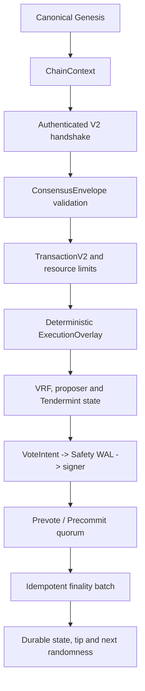

# Rust-Norn V2 安全重构 Walkthrough

## 1. 范围与结论

本报告以提交 `b65343c` 为前一轮基线，记录已合入的 `046d240` 以及本轮针对审查意见的未提交 P0 修复。

结论：Candidate V2 的主路径和恢复硬化已有实质性实现，但本轮审查暴露的异步结果隔离与 Action 错误可观测性刚完成修复，仍需逐阶段审查和完整门禁复验；项目不标记为 `production-ready`。正式上线前仍需完成治理交易接入、独立安全审计、长期故障演练、部署 runbook 和 release review。

## 2. 端到端执行路径



关键安全顺序为：网络身份验证 → 纯执行与 commitment 校验 → WAL 持久化意图 → 签名及 SignedVote 持久化 → 广播 → 达成 finality → 单批次持久化并 flush → 更新缓存和广播 Commit。

## 3. 已完成的主要改动

### 链身份、Genesis 与版本

- 引入 `NetworkMode`、`NodeRole`、`ChainContext` 和版本化 Genesis schema。
- Genesis canonical encoding、Genesis hash、Validator snapshot hash 和 proposer 序列均确定性生成。
- Production 缺少 Genesis、Validator 密钥不匹配、重复身份、零权重、权重溢出或数据库 Genesis 不一致时 fail-closed。
- V2 节点不依赖旧格式反序列化猜测；未知版本和旧 live Proposal 在网络入口拒绝。

### 交易、区块与执行

- `TransactionV2` 移除 `block_hash`、`height`、`index` 等循环字段，交易 ID、Merkle root 和 BlockV2 commitment 自包含且稳定。
- `ExecutionOverlay` 提供确定性读取、排序写集、状态根和执行结果 commitment；验证失败不会污染 live state。
- 区块字节数、交易数、gas、签名成员数和 overlay 写集均受协议参数约束。
- TxPoolV2 具备容量上限、ID 去重和确定性选择。

### VRF、随机性、epoch 与共识

- VRF 使用 verify-and-derive，Proposal 不携带可伪造的 `vrf_score`。
- 验证后的 randomness 唯一地成为下一高度的 `parent_randomness`。
- proposer 选择绑定 chain、epoch、height、round、parent randomness 和 snapshot hash。
- epoch snapshot、ValidatorChange、jailing、slashing 和延迟生效规则在状态机层确定性执行；pending changes 与 next snapshot 随 finalized record 同批持久化，并在重启时恢复。
- 当前尚未把 `ValidatorChange` 接入 `TransactionV2`/system-governance admission；现有 queue API 不能单独宣称治理交易已经上线。
- Prevote、Precommit、NIL、锁定/解锁、valid round 和 timeout 规则固定并有状态机测试。
- `ConsensusDriver` 使用单写入队列和 generation/height/round/snapshot/parent context token；真实 round 变化、上下文变化和旧 worker completion 会被丢弃。
- `ConsensusAction` 采用 Intent/Ack 语义；带 reply 的 Action 错误会返回调用方，无 reply 的内部 Action 错误会记录并 fail-stop，不再静默丢失。具体 Action 的有限重试策略仍需后续补齐。

### 网络与节点角色

- `ConsensusEnvelope`、topic namespace 和 handshake 绑定 wire/protocol version、chain ID、Genesis hash、角色及 PeerId。
- bootstrap/Dial 地址必须显式包含 `/p2p/<PeerId>`，连接关闭后清除认证状态并重新握手。
- V2 使用显式 `bootstrap_peers`；mDNS 不编译进 V2 行为，`mdns=true` 配置直接拒绝，避免未经认证的本地发现入口。
- `libp2p` 升级至 `0.56`，并适配 Kademlia 配置 API。
- FullNode 只执行验证、同步和 Commit 应用，不持有或调用验证者签名密钥。
- Validator 与 FullNode 均可通过有序 FinalityResponse 恢复 canonical finalized records。

### Finality、存储与恢复

- 所有 V2 路径使用统一 `CanonicalFinalizedTip`，严格检查高度、父哈希、状态根、epoch 和 randomness successor 关系。
- block、certificate、tip、consensus state、snapshot 和 canonical state 使用同一 Sled batch 持久化。
- `FinalizeTransactionId { height, block_id, certificate_hash }` 保证重复提交幂等；同高度不同 block fail-closed。
- `apply_batch` 成功但 flush 返回错误或进程崩溃时，重启通过 durable marker 恢复完整旧状态或完整新状态，不依据瞬时错误类型猜测结果。
- Commit 仅在持久化和 flush 成功后广播。
- 恢复时缺少 durable next snapshot 会 fail-closed，不会使用进程内 pending changes 猜测链上验证者集合。

## 4. 依赖安全处理

本轮使用 `cargo audit` 检查 Cargo.lock，并完成以下可安全升级项：

- `bytes`、`crossbeam-epoch`、`time`
- `libp2p 0.53 → 0.56`
- `prometheus 0.13 → 0.14`，连带 `protobuf 2.28 → 3.7.2`
- `ruint 1.17.2 → 1.20.0`
- 移除 V2 默认构建中的 DNS/mDNS feature，清除实际网络构建中的旧 `ring` 和旧 `rustls-webpki` 链。

当前 `cargo audit --no-fetch --no-yanked` 仍报告 2 个 `hickory-proto 0.25.2` advisory，以及 13 个维护性/健壮性 warning。hickory 来自 libp2p 锁定元数据中的可选依赖；默认 feature tree 中不可达，但 cargo-audit 按 Cargo.lock 进行扫描，因此没有被静默忽略。该项仍需后续依赖链升级或经过审查的审计例外决策。

## 5. 验证结果

本轮已通过的定向门禁：

```text
cargo fmt --all -- --check
cargo test --workspace --locked -j 1
cargo test -p norn-core --lib consensus::driver --locked
cargo test -p norn --test four_process_v2_bft --locked
git diff --check
```

本轮修改后的完整 workspace 测试已复验通过；完整 workspace clippy 目前仍受既有 warning 阻断，不能作为已通过门禁；
`cargo audit` 仍报告 `hickory-proto 0.25.2` 的 2 个 advisory 和 13 个维护性/健壮性 warning。

最终结果包括：

- workspace 测试本轮全部通过，无失败；ConsensusDriver 定向测试 10 个通过；
- 四进程 Validator/FullNode BFT 测试通过，覆盖十个高度、proposer kill/restart、恢复和网络隔离；
- stale worker completion 已覆盖 generation、真实 round 变化、snapshot 和 parent context；内部无 reply Action failure 已覆盖 fail-stop 行为；
- 编译无错误；仍需处理既有 unused、deprecated、unexpected-cfg 等 warning，
  才能关闭 `-D warnings` clippy 门禁。

## 6. 最终状态

```text
ConsensusDriver and timeout path: substantially completed
Durable finality recovery: substantially completed
Stale async-result isolation: implemented and covered by targeted/four-process tests
Consensus action failure propagation: fail-stop implemented; explicit Action retry policy remains
Validator authorization: complete for static Genesis set
Governance admission and dynamic authorization: pending
Verification gates: workspace tests/fmt/diff passed; clippy and audit remain open
Cargo audit: 2 hickory advisories + 13 warnings remain
Production status: Candidate only
Commit status: current P0 follow-up changes are uncommitted
```
