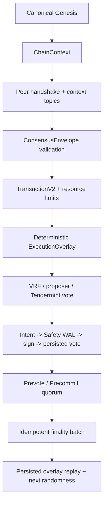

# Rust-Norn Comprehensive Refactoring Walkthrough Report

## 1. Scope and conclusion

本报告以提交 `a8631c5` 及其后的当前工作区为审查基线，覆盖已批准的
Candidate v4 Final 八阶段安全重构计划。

结论：八个实现阶段均已完成，阶段性测试门禁全部通过；项目可以作为
Candidate 验收版本交付。按照既定要求，本报告不将当前代码标记为
production-ready。正式上线前仍需要独立安全审计、长时间压力/故障演练和
部署级验收。

协议升级采用方案 A：不猜测兼容旧序列化数据，而是使用新的版本化协议对象
和新的 canonical Genesis/chain identity。未知版本、错误 Genesis 或不匹配的
数据库身份均 fail-closed。

## 2. 整体执行路径



关键原则是：网络消息先绑定链身份，交易执行先产生无副作用的确定性写集，
投票先持久化安全意图再签名，最终性先完成原子持久化再广播 Commit。

## 3. 八阶段实现结果

### 阶段一：链身份、Genesis 与节点角色

- 引入 `NetworkMode`、`NodeRole`、`ChainContext`。
- Genesis schema、canonical encoding、Genesis hash 和 snapshot hash 已版本化。
- Production 缺少显式 Genesis、Validator 密钥不匹配、重复 ValidatorId/public key/VRF key、零权重、权重溢出或数据库 Genesis 不一致时启动失败。
- FullNode 无验证者私钥可以启动，但不会产生投票。
- 四份独立配置可生成相同 snapshot/proposer 序列。

主要位置：`crates/node/src/config.rs`、`crates/common/src/genesis.rs`、
`crates/common/src/chain_context.rs`。

### 阶段二：严格网络入口

- ConsensusEnvelope 绑定 `wire_version`、`protocol_version`、`chain_id`、
  `genesis_hash` 和 payload。
- topic namespace 同样绑定完整 ChainContext。
- 握手加入发送方 PeerId，并要求它等于 libp2p transport source，避免不同
  节点的相同 role/context 握手被 gossipsub 去重。
- bootstrap/Dial 地址必须显式包含 `/p2p/<PeerId>`。
- 只有完成握手的 Validator 可以发送 consensus；FullNode consensus 输入被拒绝。

主要位置：`crates/network/src/event_loop.rs`、
`crates/network/src/service.rs`、`crates/common/src/chain_context.rs`、
`docs/network-wire-v2.md`。

### 阶段三：TransactionV2 与确定性执行

- 交易移除 `block_hash`、`height`、`index`，消除交易 ID、区块 hash 和 Merkle
  root 的循环依赖。
- 引入强类型 TransactionV2/BlockV2、canonical encoding、V2 Merkle/header commitment。
- ExecutionOverlay 先执行、后统一产生有序写集和 projected state root，不在验证
  阶段污染 live state。
- TxPoolV2 使用有界容量、ID 去重和确定性选择，提议失败不会丢失交易。
- 区块字节数、交易数、gas、写集和验证并发等限制由 Genesis 协议参数约束。

主要位置：`crates/common/src/types.rs`、`crates/core/src/execution/overlay.rs`、
`crates/core/src/txpool_v2.rs`、`docs/transaction-v2.md`。

### 阶段四：VRF、randomness、epoch 与证书

- VRF 只通过 verify-and-derive 获得 randomness；proposal 不携带可伪造的
  `vrf_score`。
- randomness 只能由验证后的 VRF 派生，并作为下一高度的 parent randomness。
- proposer 由 chain/epoch/height/round/parent randomness/snapshot hash 确定性选择。
- epoch snapshot 规则固定，CommitCertificate 使用 ValidatorId 字节序 canonical 排序。
- future height/round、证书成员数量和 snapshot 成员数量均受限。

主要位置：`crates/core/src/consensus/povf.rs`、
`crates/core/src/consensus/state_machine.rs`、
`crates/common/src/consensus_types.rs`。

### 阶段五：Tendermint 状态机与 Intent/Ack

状态转换顺序固定为：

```text
VoteIntent
  -> Safety WAL durable intent
  -> real signer
  -> durable SignedVote
  -> broadcast
  -> VotePersisted acknowledgement
  -> state-machine step/lock transition
```

- WAL 失败：不签名、不广播、不推进状态。
- signer 失败：不广播，状态保持可重试。
- 广播失败：已产生的签名只能重播同一票，不得改签其他 block。
- 重启时恢复并重新广播 exact signed vote。
- Proposal、Prevote、NIL、Precommit、锁定、解锁、timeout 和 finality 规则已写入
  `docs/consensus-tendermint-v2.md`。

主要位置：`crates/core/src/consensus/safety_store.rs`、
`crates/core/src/consensus/state_machine.rs`、
`docs/consensus-tendermint-v2.md`。

### 阶段六：最终性原子提交与恢复

- FinalizeTransactionId 为 `{height, block_id, certificate_hash}`。
- 相同最终性事务重复提交幂等；同高度不同 block/certificate fail-closed。
- block、certificate、consensus state、finalized marker、overlay write-set、
  transaction marker 和 tip 在单次数据库 batch 中持久化。
- `apply_batch` 成功但 `flush` 返回错误或进程崩溃时，重试通过 durable marker
  判断结果，不依据调用时错误类型猜测状态。
- 重启从 durable finalized record 恢复精确证书和写集；重复 Commit 不要求内存中仍有候选块。

主要位置：`crates/core/src/finality.rs`、
`crates/core/src/execution/overlay.rs`、`crates/node/src/service.rs`、
`crates/core/src/blockchain.rs`。

### 阶段七：P2P、Byzantine 与多进程验证

- 网络库支持显式监听地址、Dial、bootstrap 连接和连接状态事件。
- connection close 清除认证状态，reconnect 重新发布握手。
- 进程内多节点测试覆盖两 Validator 和一个 FullNode。
- OS 子进程测试 `stage7_process_test` 启动独立 Validator/Validator/FullNode worker，
  验证跨进程 bootstrap、握手、Validator consensus 传递、FullNode consensus 拒绝和
  错误 Genesis 隔离。

主要位置：`crates/network/src/bin/stage7_worker.rs`、
`crates/network/tests/stage7_process_test.rs`、
`crates/network/src/service.rs`。

### 阶段八：模型、fuzz 与最终门禁

- bounded Tendermint lock/unlock model 穷举 lock round、candidate、valid round 和
  certificate 组合，确认不同 block 只能凭有效 valid-round certificate 解锁。
- wire fuzz corpus 对合法 envelope 每一位翻转，并执行 2,048 个有界伪随机 byte input；
  decoder 均只返回错误或成功，不发生 panic 或无界分配。
- `cargo test --workspace -j 1` 全部通过。
- `cargo fmt --all -- --check` 和 `git diff --check` 通过。

门禁清单见 `docs/verification-gate.md`。

## 4. 已执行验证

```text
cargo test --workspace -j 1
cargo test -p norn-network --test stage7_process_test -- --nocapture
cargo test -p norn-core --test four_node_bft_test -- --nocapture
cargo test -p norn-core --lib finality -- --nocapture
cargo fmt --all -- --check
git diff --check
```

最终 workspace 回归结果包括：

- `norn-common`：37 tests passed；
- `norn-core`：236 library tests passed；
- `norn-network`：13 library tests passed；
- OS process network test：1 passed；
- four-node BFT integration：1 passed；
- 其余 workspace crates/integration targets：全部 passed，无 failed。

编译输出仍有既有 unused/deprecated/config warning，但没有编译错误或测试失败。

## 5. 后续事项与上线边界

实现阶段没有阻塞性后续任务。以下是 production 前的独立验收事项，而不是本轮
Candidate 实现缺口：

1. 对共识、VRF、签名、Genesis migration 和持久化恢复进行独立第三方安全审计；
2. 在目标操作系统和实际文件系统上进行长时间 crash/kill、磁盘满、I/O error、网络分区和重连演练；
3. 在 CI/隔离环境中追加 native libFuzzer 长时间运行，并记录 corpus、覆盖率和崩溃复现结果；
4. 按新 Genesis 网络策略编写正式部署、密钥轮换、回滚和数据库备份恢复 runbook；
5. 通过正式 release review 后，才能将 Candidate 改为 production-ready。

## 6. 最终状态

本次 walkthrough 结论为：

```text
Implementation: complete
Verification gates: passed
Protocol migration policy: decided (new Genesis + versioned objects)
Production status: Candidate only
```
